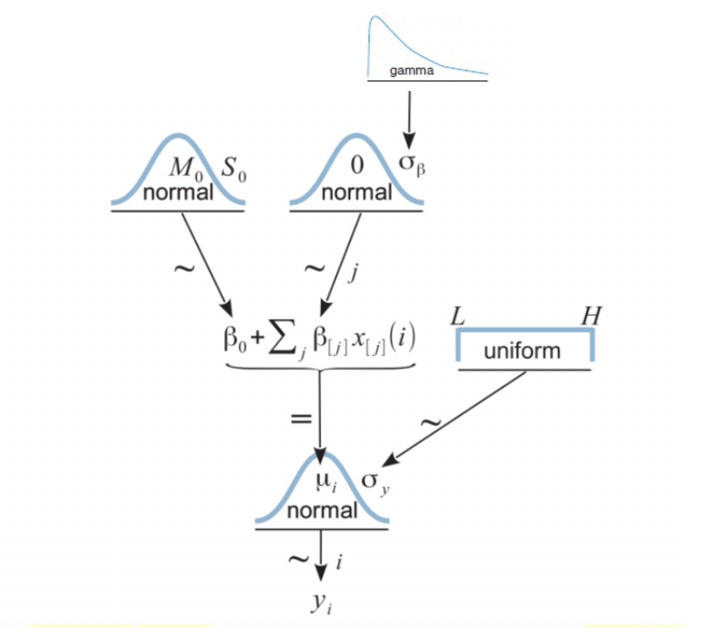
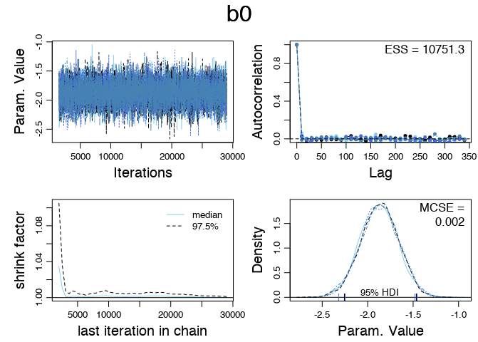
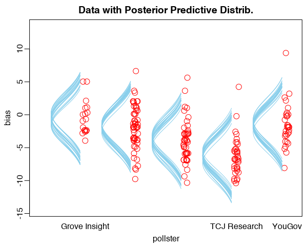
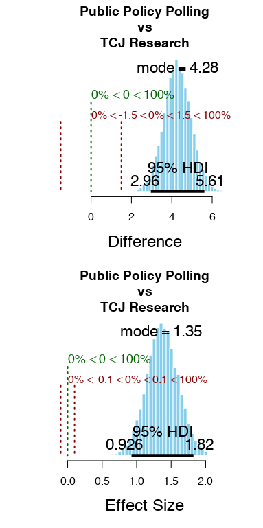

```{r setup, include=FALSE}
knitr::opts_chunk$set(echo = FALSE, error=FALSE, warning=FALSE)
knitr::opts_knit$set(root.dir = dirname(getwd()))
```

**Introduction**

To understand pollster bias, we can use a Bayesian modeling to describe metric data as function of nominal predictors, similar to traditional ANOVA modeling. We will do so with using pollster data compiled by FiveThirtyEight. Here, we will explore how the specific pollster can act as an explanatory variable to predict bias present in individual polls. 

It is of interest to include this nominal predictor of pollster because there is a historical precedent for bias due to systematic polling error and housing effects [@ReadPollsBetter]. 

```{r, include=FALSE, fig.show='hide'}
source(here::here('RScripts', 'ANOVA model - just pollsters.R'))
```

Because there are so many pollsters, for the sake of simplification, we will look at just the few pollsters with at least `r minPolls` in the `r DesiredYear` `r preferredType` election.

**Data Exploration**

To begin our exploration of the data, we can look at the density plot for the bias of each of our isolated pollsters in the `r DesiredYear` `r preferredType` election. 

Note: Positive Bias is bias towards the democratic party. 

```{r}
#density plot 
lattice::densityplot(~bias,data=myDataMyPollsters,
            groups=pollster,
            xlab="Bias",
            main="Pollster Bias",
            plot.points=TRUE,
            auto.key=TRUE)
```

The analysis of distinguishing between pollsters seems valid based on this visualization because of the clear differences between individual pollsters seen below. The center, as well of the spread, of pollsters' bias seems to vary greatly. Those patterns indicate that it would be helpful to build a model that uses pollsters as a nominal variable. In traditional statistics, this would mean ANOVA modeling, but we can answer the same questions of interest with a Bayesian model that closely imitates ANOVA models. 

**The Model**

The Bayesian hierarchical implemented here starts with generic noncommittal parameters. Specifically:
 
 * Within group standard deviation,$\delta_{y}$, is given a broad uniform prior distribution.  
 * Baseline,$\beta_{0}$, is given a normal vague prior distribution, made broad on the scale of the data.
 * Group deflection parameters,$\beta_{j}$, are given a prior distribution centered at zero to satisfy the summing to zero condition.
 * Prior distributions for group standard deviations,$\delta_{\beta}$, comes from a gamma distribution with a nonzero mode. This allows each group's standard deviation's prior to be influence by all other groups. 
 
 These are all vague priors as to not greatly influence the posterior distribution. 
 
The model diagram can be seen below:


While we can avoid sampling variability assumptions with Bayesian Analysis, it is necessary to check for proper convergence of the MCMC chains. In running this analysis, all parameters should be checked for convergence. A test for convergence of $\beta_{0}$ can be seen below.


The density plots are sufficiently converged after the burn-in period, the autocorrelation appears small enough, and there is nothing in these plots that suggest it would not be safe to continue with the Bayesian analysis.

In this analysis, one of the main objectives is to find whether or not there is a difference of bias between pollsters. To do so, we must develop a reasonable ROPE for the difference between nominal groups. A difference of 1% bias is practically equivalent to zero, so the ROPE can be established as -1 to 1 for the purposes of this analysis.

Posterior distributions are shown below:



We can see this further with this visual comparison between Public Policy Polling and TCJ. TCJ appears to be more democratic leaning in bias.




Of special note, all of the credible values fall outside of the Region of Practical Equivalence. Meaning there is statistical evidence that there was a difference in bias between these two pollsters in the `r DesiredYear` election. We can reject the hypothesis that there is no difference in bias between these two pollsters.

The most credible values and the highest density intervals for each parameter value can be seen below:

```{r echo=FALSE, out.width="100%",  fig.align='center', error=TRUE, message=FALSE}
library(magrittr)

dt <- summaryInfo[, 1:7]
dt %>%
  knitr::kable() %>%
  kableExtra::kable_styling(bootstrap_options = c("striped", "hover"))
```

**Conclusion**

Contextually, this means for polls from `r DesiredYear` `r preferredType` election, the average democratic bias between all pollsters was `r FoundMean`.

Using FiveThirtyEight's data, this Bayesian model with the nominal predictor of pollsters for determining poll bias can show a clear difference between certain pollsters. Using this model, we found that pollsters have different bias and different magnitudes of that bias. However; since these samples were pulled from only the pollsters with the most polls available in the polling cycle, it may be more difficult to see similar patterns applied to all pollsters. 


\newpage
## Works Cited

---
#.bib for bib refrence
nocite: |
  @538rawpolldata
  @KrusckeTextbook
---