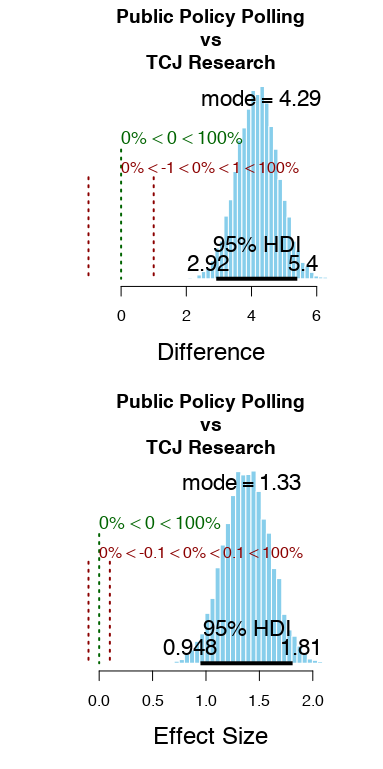

```{r setup, include=FALSE}
knitr::opts_chunk$set(echo = FALSE, error=FALSE, warning=FALSE)
knitr::opts_knit$set(root.dir = dirname(getwd()))
```

To understand pollster bias, we can use Bayesian hierarchical modeling. We will do so with using pollster data compiled by FiveThirtyEight.

```{r, include=FALSE, fig.show='hide'}
source(here::here('RScripts', 'ANOVA model - just pollsters.R'))
```

A posterior predictive plot comparing the selected pollsters' bias is shown below. This motivates an analysis that separates pollsters, there seems to be actual differences between these pollsters.


We can see this further with this visual comparsion between Public Policy Polling and TCJ. TCJ appears to be more democratic leaning in bias.




```{r echo=FALSE, out.width="100%",  fig.align='center', error=TRUE, message=FALSE}
library(magrittr)

dt <- summaryInfo[, 1:7]
dt %>%
  knitr::kable() %>%
  kableExtra::kable_styling(bootstrap_options = c("striped", "hover"))
```

\newpage
## Works Cited

---
#.bib for bib refrence
nocite: |
  @538rawpolldata
---