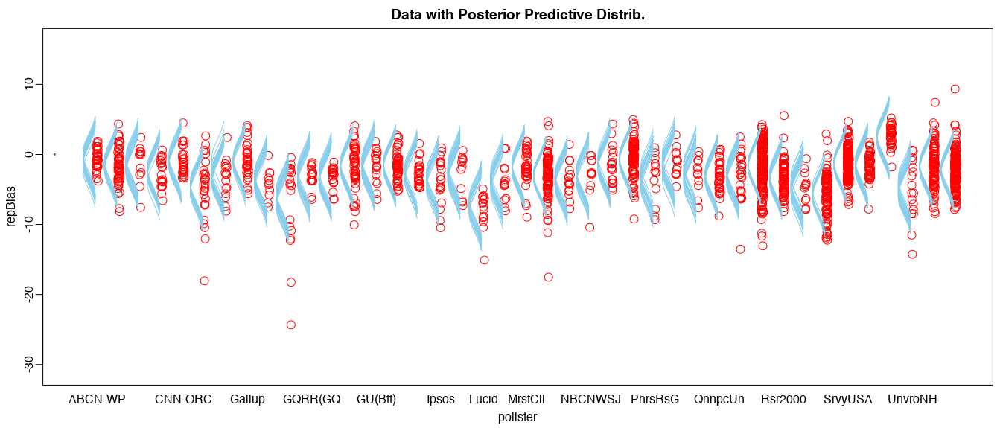

```{r setup, include=FALSE}
knitr::opts_chunk$set(echo = FALSE, error=FALSE, warning=FALSE)
knitr::opts_knit$set(root.dir = dirname(getwd()))
```

To understand pollster bias, we can use Bayesian hierarchical modeling. We will do so with using pollster data compiled by FiveThirtyEight.

```{r, include=FALSE, fig.show='hide'}
source(here::here('RScripts', 'ANOVA model - just pollsters.R'))
```




```{r echo=FALSE, out.width="100%",  fig.align='center', error=TRUE, message=FALSE}
library(magrittr)

dt <- summaryInfo[, 1:7]
dt %>%
  knitr::kable() %>%
  kableExtra::kable_styling(bootstrap_options = c("striped", "hover"))
```