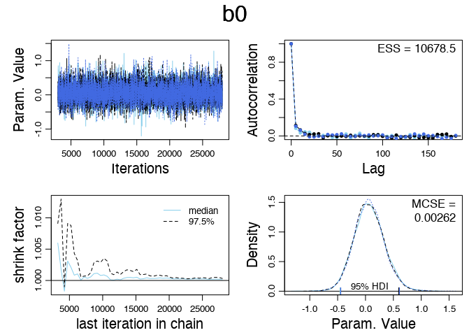
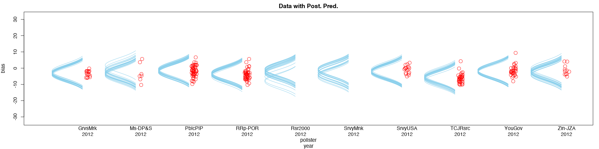
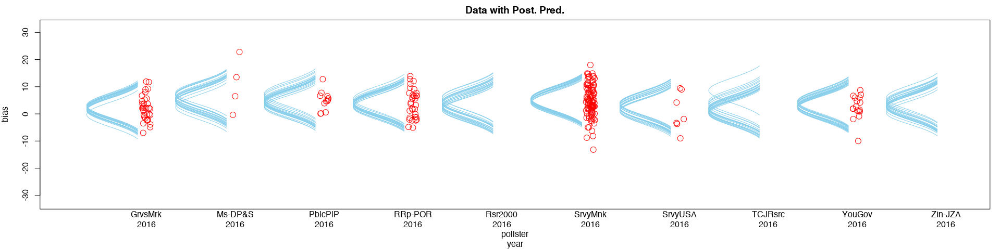
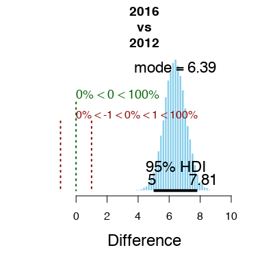

```{r setup, include=FALSE}
knitr::opts_chunk$set(echo = FALSE, error=FALSE, warning=FALSE)
knitr::opts_knit$set(root.dir = dirname(getwd()))
```

## Introduction

To understand pollster bias, we can use a Bayesian modeling to describe metric data as function of nominal predictors, similar to traditional ANOVA modeling. We will do so with using pollster data compiled by FiveThirtyEight. Here, we will explore how the specific pollster and election year can act as an explanatory variable to predict bias present in individual polls. 

It is of interest to include this nominal predictor of pollster because there is a historical precedent for bias due to systematic polling error and housing effects [@ReadPollsBetter] in presidential elections. 

Including year is logical because of the swings in bias of pollsters throughout the years. For example, during the 08' and 12' elections, pollsters seemed to underestimate the power of democratic vote share, where in 2016 the opposite appeared to be true.

```{r, include=FALSE, fig.show='hide'}
source(here::here('RScripts', 'twoWayANOVA.R'))
```

##Data Exploration

Because there are so many pollsters, for the sake of simplification, we will look at just the few pollsters with at least `r minPolls` between `r earlyYear` and `r lateYear` election.

Note: Positive Bias is bias towards the democratic party. 

```{r}
#density plot 
lattice::densityplot(~bias,data=myDataFrame,
            groups=pollster,
            xlab="Bias",
            main="Pollster Bias",
            plot.points=TRUE,
            auto.key=TRUE)
```

Pollster Abbreviations:
```{r echo=FALSE, out.width="100%",  fig.align='center', error=TRUE, message=FALSE}
library(magrittr)

keyPollsterNames %>%
  knitr::kable() %>%
  kableExtra::kable_styling(bootstrap_options = c("striped", "hover"))
```


The analysis of distinguishing between pollsters seems valid based on this visualization because of the clear differences between individual pollsters seen below. The center, as well of the spread, of pollsters' bias seems to vary greatly. Those patterns indicate that it would be helpful to build a model that uses pollsters as a nominal variable. In traditional statistics, this would mean ANOVA modeling, but we can answer the same questions of interest with a Bayesian model that closely imitates ANOVA models. 

Similarly we will seperate by year:

```{r}
lattice::densityplot(~bias,data=myDataFrame,
            groups=year,
            xlab="Bias",
            main="Bias By Year",
            plot.points=TRUE,
            auto.key=TRUE)
```

## The Model

The Bayesian hierarchical implemented here starts with generic noncommittal parameters.

The model diagram can be seen below:


While we can avoid sampling variability assumptions with Bayesian Analysis, it is necessary to check for proper convergence of the MCMC chains. In running this analysis, all parameters should be checked for convergence. A test for convergence of $\beta_{0}$ can be seen below.


The density plots are sufficiently converged after the burn-in period, the autocorrelation appears small enough, and there is nothing in these plots that suggest it would not be safe to continue with the Bayesian analysis.

In this analysis, one of the main objectives is to find whether or not there is a difference of bias between pollsters and tears. To do so, we must develop a reasonable ROPE for the difference between nominal groups. A difference of 1% bias is practically equivalent to zero, so the ROPE can be established as -1 to 1 for the purposes of this analysis.

Posterior distributions are shown below:





We can further see the dramatic differences between 2012 and 2016 with comparsion plot below:



Of special note, all of the credible values fall outside of the Region of Practical Equivalence. Meaning there is statistical evidence that there was a difference in bias between pollster bias in the 2012 and 2016 elections. We can reject the hypothesis that there is no difference in bias between these years.

Between individual pollsters, the differences are less definite. 


Between interaction terms the differences get even smaller...

2012.v.2008.png)

The most credible values and the highest density intervals for each parameter value can be seen below:

```{r echo=FALSE, out.width="100%",  fig.align='center', error=TRUE, message=FALSE}
library(magrittr)

dt <- summaryInfo[, 1:7]
dt %>%
  knitr::kable() %>%
  kableExtra::kable_styling(bootstrap_options = c("striped", "hover"))
```


## Conclusion

Using FiveThirtyEight's data, this Bayesian model with the nominal predictors of pollster and year for determining poll bias can show a clear difference between certain combinations. Using this model, we found that different pollsters and different years have different bias and different magnitudes of that bias. However; since these samples were pulled from only the pollsters with the most polls available in the polling cycle, it may be more difficult to see similar patterns applied to all pollsters. 


\newpage
## Works Cited

---
#.bib for bib refrence
nocite: |
  @538rawpolldata
  @KrusckeTextbook
---